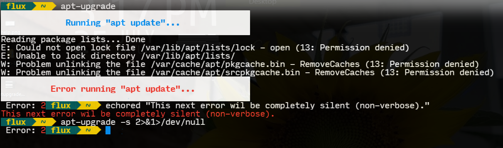

# Apt-Upgrade

    

***&#42;&#42;&#42;Note:&#42;&#42;&#42;***

***I will be giving credit to the author of the foul module which I will add on 4/7/20, but I do have plans to write a different module of the same thing very soon.***

## Index

1. [Description](#description)
2. [Motivation](#motivation)
3. [Usage](#usage)
4. [Files](#files)
   1. [Source Files](#source)
   2. [Source/Mod Compiled](#sourcem)
   3. [Full Project](#project)
   4. [Compiled](#compiled)
   5. [This Repository](#repo)
   6. [Release Page](#release)
5. [Media](#media)
   1. [Help Screen](#help)
   2. [Upgrade](#upgrade)
   3. [Error Handling](#errors)
6. [License](#license)

## Description <a id="description"></a>

A nice little wrapper cli utility to help update and upgrade programs installed with the **APT** package manager with error handling and color output. Written in ***Fortran*** (yes).

## Motivation <a id="motivation"></a>

I like to write tools for things do often. And I just love to program for no reason at all...

## Usage <a id="usage"></a>

This is a compiled command line interface executable and can be executed in any normal manner as any other cli exectuable; Shells Bash, ZSH, SH, etc... It can, of course, be used in scripts or programs and since it has exit codes better control can be had over said scripts.

It can be used with "sudo" as I'd hope one might use and have set up properly.

```Bash
 $ # If in path:
 $ sudo apt-upgrade --help

 Usage: apt-upgrade [OPTION]...
 Run "apt update" and "apt upgrade -y"

 Options:
     -h, --help       this help screen.
     -s, --silent     run silently when possible. 

 Exit Codes:
     0                no error.
     1                APT not found.
     2                error in "apt update"       
     3                error in "apt upgrade -y"   
 $
 $ # Run completely silent; APT is hard to supress,
 $ # my internal code plus this extra is full
 $ # supression.
 $ sudo apt-upgrade -s 2>&1>/dev/null
 $
```

## Files <a id="files"></a>

Everything for this project can be found here from source files to compiled executables.

- [Source Files](./source.7z) <a id="source"></a>
- [Source With Compiled Module](./source_with_compiled_mod.7z) <a id="sourcem"></a>
- [Archived Full Project Files](./project.7z) <a id="project"></a>
- [Compiled Exectuable](./dist/apt-upgrade) <a id="compiled"></a>
- [This Repository](https://github.com/Lateralus138/Apt-Upgrade) <a id="repo"></a>
- [Release Page](https://lateralus138.github.io/Apt-Upgrade) <a id="release"></a>

## Media <a id="media"></a>

### Help Screen

 <a id="help"></a>

### Upgrade

 <a id="upgrade"></a>

### Errors

Error here is thrown by not being sudo.

 <a id="errors"></a>

## [License](./LICENSE) <a id="license"></a>

>This program is free software: you can redistribute it and/or modify it under the terms of the GNU General Public License as published by the Free Software Foundation, either version 3 of the License, or (at your option) any later version.

>This program is distributed in the hope that it will be useful, but WITHOUT ANY WARRANTY; without even the implied warranty of MERCHANTABILITY or FITNESS FOR A PARTICULAR PURPOSE.  See the GNU General Public License for more details.
